# Projet de compilation
Goulven Le Pennec, M1 ASSEL 2023-2024<br>
Dernière mise à jour 5/05/2024

1. Problématique
2. Fonctionnalités
3. Installation
4. Lancement du programme
5. Grammaire
6. Application de la grammaire
7. Commandes
8. Pour le développeur
9. Axes d'amélioration
______________________________


## 1 - Problématique
L'apprentissage des fondamentaux en langage de programmation impérative suit globalement les mêmes règles pour les 
langages de haut niveau. Cependant les langages diffèrent entre eux au niveau des détails syntaxiques.

À ce titre nous proposons un analyseur lexical pour permettre à un utilisateur débutant d'apprendre à exprimer les 
bases en programmation impérative et d'indenter convenablement son code.<br>
Par ailleurs nous offrons la possibilité à l'utilisateur de convertir son langage algorithmique en **langage C**.<br>
Ceci peut lui permettre notamment de vérifier la fonctionnalité de son code en compilant directement le fichier obtenu
avec la commande:

```bash
gcc -Wall <fichier source> -o <fichier de destination>
```
nb: le fichier source doit avoir pour extension `.c`

Cet outil devient par conséquent une excellente porte d'entrée dans le code de façon générique.<br>
Si les principes de base sont acquis, les conventions d'écriture ne sont plus qu'un détail à assimiler!

## 2 - Fonctionnalités
Le programme offre plusieurs fonctionnalités:
- Un **pretty printer**: cette fonctionnalité permet d'indenter convenablement le code selon les conventions standard 
(nb: dans le programme actuel, 1 indentation correspond à 4 espaces)
- Un **convertisseur en langage C**: en fonction d'un fichier de référence valide écrit en langage algorithmique 
suivant la grammaire du programme (voir *Grammaire*), un fichier en langage C peut être généré.
- Un **système de sauvegarde** du contenu au format pretty printer ou bien en langage C sous la forme d'un fichier, 
très pratique pour progresser!
- Enfin, le programme est en mesure d'aider à l'**identification d'un certain nombre d'erreurs** se trouvant au sein du fichier à 
traiter.<br>
  - Le répertoire `testfiles/` contient des fichiers avec le préfixe `errors` pour illustrer ceci:
    - *error5.txt* &rarr; identification de tokens invalides à notre langage algorithmique, ici le caractère *"$"*
      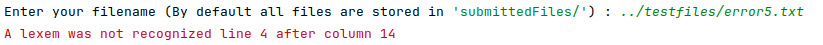
    - *error2.txt*: les oublis (ici l'accent aigu sur *booléen*), dénaturant alors le sens du mot 
      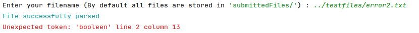
    - *error1.txt* &rarr; assignation incomplète ou déclaration ratée
      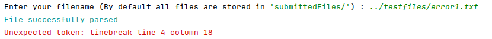
    - *error3.txt* &rarr; oubli de déclaration du typage dans la déclaration de fonction
      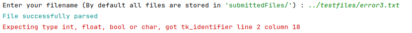
    - *error4.txt* &rarr; absence de retour pour une fonction qui est supposée en contenir.
      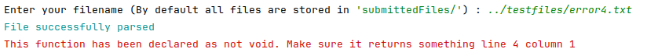


## 3 - Installation
### 3.1 - Pré-requis
Le programme a été implémenté en Python 3.12.3.<br>
Une seule librairie extérieure à la librairie standard de Python est nécessaire: Colorama.
Vous pouvez l'installer sur votre système ou bien dans un environnement virtuel dédié au projet.

Pour installer les dépendances:
```bash
pip install -r requirements.txt
```

## 4 - Lancement du programme
- Dézipper le projet
- Ouvrir le projet dans votre IDE préféré
- Exécuter le fichier `Gui.py`

Le programme se lance dans le terminal au travers d'une IHM minimaliste pour vous accompagner au travers d'une
expérience utilisateur de qualité!

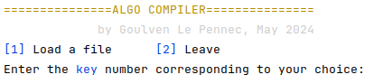

L'IHM via une console permet de limiter le recours aux dépendances au sein du projet et permet une portabilité très
facile du projet.<br>
Il ne reste plus qu'à suivre les étapes pour profiter des atouts de l'application! 


## 5 - Grammaire
Les règles de grammaire suivantes ont été implémentées afin de définir un langage algorithmique pour la programmation 
impérative. Le programme répond à ces conventions d'écriture pour traiter et formater le texte comme il se doit.

- program := function* declaration* statement*
- function := identifier ( (type identifier,?)* ): type debut (declaration* statement*)* (retourner expression)? fin
- declaration := type identifier([int])?
- assign_on_declaration = <- expression
- assignment := identifier([int])? <- expression
- type := booleen, entier, chaine, reel, car, entier
- statement := assignment | if_statement | for_statement | while_statement | do_while_statement
- if_statement := si expression alors statement* (else_if|else)? finSi
- else_if := sinon si expression alors statement*
- else := sinon statement*
- for_statement:= pour identifier de identifier|literal à identifier|literal faire statement* finPour
- while_statement := tant que expression faire statement* finTantQue
- do_while_statement := faire statement* tant que expression;
- expression := conjunction (ou conjunction)*
- conjunction := equality (et equality)*
- equop := ==|!=
- equality := relation (equop relation)?
 -relation := addition (relop addition)?
- relop := < | <= | > | >=
- addition := term (addop term)*
- addop := +|-
- term := factor (mulop factor)*
- mulop := * | / | %
- factor := (non(|-)? primary )?
- primary := identifier([expression])? | literal | parenth | identifier(expression?)
- parenth := (expression)
- identifier := a-zA-Z0-9_
- int literal: 0-9+
- float literal: 0-9+.0-9*
- boolean literal: vrai | faux
- char literal: 'a-zA-Z'
- string literal: "a-z-A-Z0-9,;:!?.*\"


## 6 - Application de la grammaire
La mise en place du langage algorithmique est plutôt basique.
Notons toutefois quelques subtilités:
- Les déclarations de variables doivent se faire en début de programme (ou en début de main) sous peine de ne pas 
retrouver de trace de ce code dans les versions pretty printer ou dans la conversion en langage C.
- Il faut nécessairement sauter une ligne après écriture de la dernière ligne de code sous réserve de ne pas trouver 
cette ligne de code lors de l'applications des différents modes du programme.


## 7 - Commandes
Chaque commande est gérée par le numéro de clé qui lui est associée. Les seules autres écritures requises concernent
soit des chemins d'accès à des fichiers ou bien des noms de fichiers à créer. 

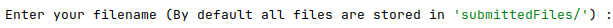
- **Chargement d'un fichier**: Permet de récupérer un fichier à traiter. Toute erreur de nom ou de destination résulte en
  une erreur. Si le fichier est trouvé, il est parcouru d'emblée. Un message apparaîtra si le contenu du fichier est 
conforme.<br>
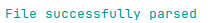

- **Quitter**: (*Leave*) quitte définitivement le programme.
- **Modes**: 2 modes existent

  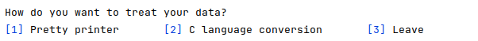

  - **Pretty printer**: met en place l'indentation selon les conventions standards.
  - **C language conversion**: convertit le fichier soumis au préalable en langage C

  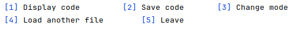

- **Display code** : affichage dans la console du mode choisi sur le contenu du fichier chargé.
- **Save code** : sauvegarde du code fichier. nb: les fichiers sont stockés par défaut dans `createdFiles/`
- Le reste de l'évolution au sein de l'application se veut simple et instinctive, les informations à disposition 
devraient suffire pour aboutir à ses fins.

### Informations à connaître:
- Des fichiers de lecture ont été testés et sont disponibles dans `algo_compiler/testfiles/` avec le préfixe *test*. 
Ils peuvent servir de source d'inspiration pour écrire en langage algorithmique. Attention toutefois: l'analyse 
syntaxique n'est pas en place, auquel cas il revient à l'utilisation de s'assurer de la cohérence de son code.
- Tout fichier soumis au programme doit comporter un **saut de ligne** après la dernière ligne de code, sinon une 
erreur survient ou bien la ligne de code n'apparaît pas dans les différents modes.


## 8 - Pour le développeur
Le projet se décompose en deux parties:
- Une partie pour la gestion de l'IHM: la classe `GUI`
- Une partie pour la gestion de l'API: l'ensemble des autres classes

  La classe `GUI` vient chercher ses endpoints au niveau de la classe `Main`
### 8.1 - Architecture fonctionnelle
  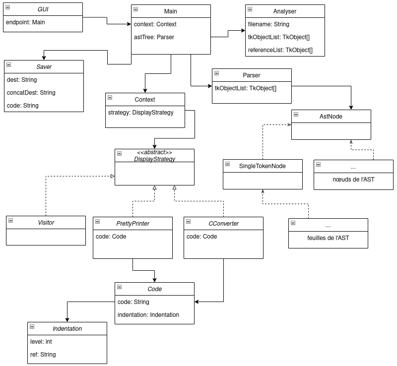
  *<center>Diagramme simplifié de l'architecture fonctionnelle<br>
  Les classes de l'AST au nombre de 27 n'ont pas été représentées ici</center>*

  La classe Main se charge d'instancier les objets nécessaires au fonctionnement du programme:
- Un objet de type Analyser, pour décomposer les données du fichier à traiter en tokens et les assigner à des objets 
  appartenant à la grammaire définie au sein du programme. Cet objet référence le lexème, sa famille (c'est-à-dire son type),
  et ses coordonnées (ligne et colonne)
- Un objet de type Parser, dont le travail est de s'assurer que l'enchaînement des lexèmes répond bien aux règles de 
  grammaire établies au sein du programme. Le parser se charge de générer l'AST (Arbre de Syntaxe Abstraite) ainsi que 
  les objets qui serviront dans les différentes fonctionnalités (Visiteur, Pretty Printer et conversion en langage C).
- Des classes annexes pour mettre en place les fonctionnalités promues par l'application: une classe pour gérer le 
  Pretty printer et une classe pour gérer la conversion des fichiers au format du langage C.
  Autour de ces objets principaux gravitent beaucoup de classes, dont la majorité sert notamment à la génération de 
  l'AST, lequel AST dépend du Parser.

- Des exceptions ont été prévues en particulier au sein des classes Parser et Analyser. Elles n'ont pas été
représentées dans le diagramme fonctionnel pour des raisons de lisibilité du schéma.

- Un pattern Strategy a également été implémenté afin de permettre une gestion facilitée des transitions d'états entre 
  l'approche *Pretty Printer* et *convertisseur en langage C*, ce pattern ouvre par ailleurs à l'extensibilité des 
  fonctionnalités de l'application selon les principes SOLID.

- Un pattern Visiteur existe aussi à l'état pur au sein de l'application mais nous avons fait un choix de dernière
  minute de ne pas l'inclure dans l'IHM du fait de son apport limité en termes de données pertinentes pour l'utilisateur.
  Il demeure néanmoins un bon outil de travail pour le développeur d'après nous, auquel cas il est possible d'y accéder 
  en le manipulant depuis la classe Main (voir le code mis en commentaire en fin de fichier).


## 9 - Axes d'amélioration
- Implémentation de la partie *"analyse syntaxique"*
- Ajout de la commande *"afficher"* dans la grammaire du programme pour permettre une visualisation directement une fois
  le langage C obtenu.
- Traiter les erreurs différemment pour ne pas mettre fin à l'application lorsqu'une exception survient.
- Trouver une alternative pour pouvoir gérer les boucles 'for' en permettant la décrémentation et éventuellement
  prendre en compte le pas de la boucle.
- Permettre des déclarations de variables n'importe où dans le code
  